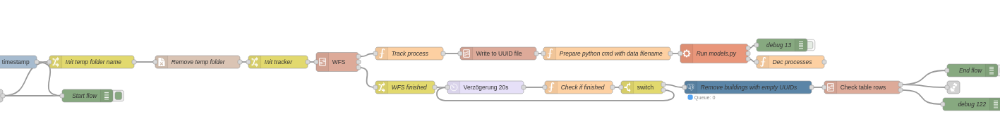
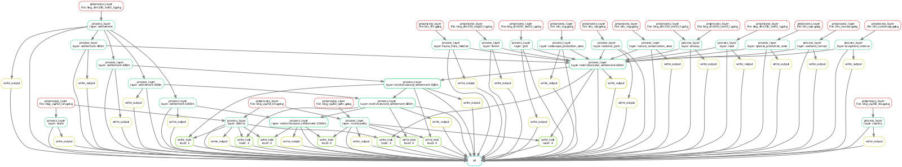
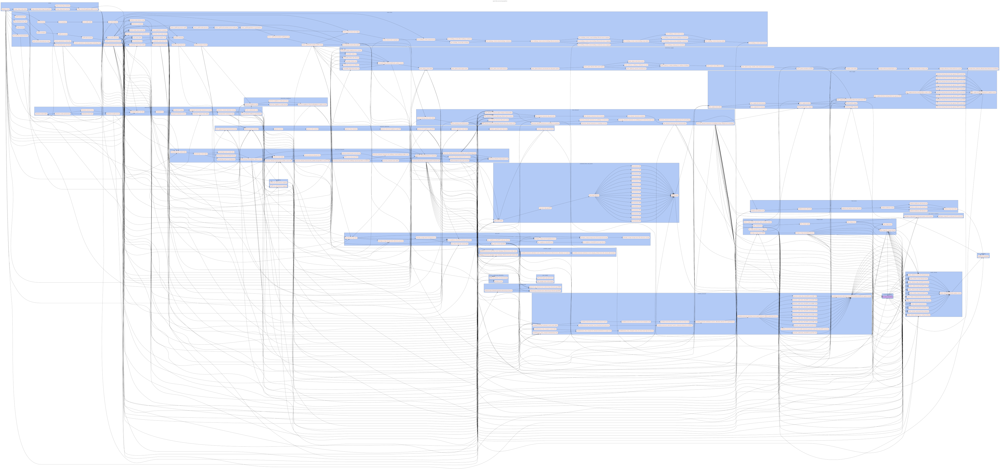
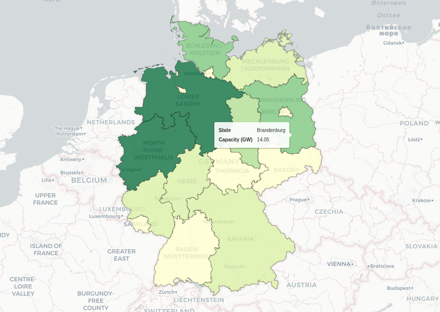

---
author:
- "Hendrik \\& Jonathan"
title: Data Pipelines
subtitle: Knowledge Sharing Series
institute: Reiner Lemoine Institut
classoption: aspectratio=169
date: 2026-06-23
theme: rli
urlcolor: rlilinkcolor
header-includes:
- |
  \usetikzlibrary{positioning,shapes.geometric,babel}
  \newcommand{\tel}{}
  \newcommand{\email}{}
  \newcommand{\twitter}{}
  \newcommand{\finalstatement}{}
---

# Knowledge Sharing Workshop Series

**Most popular topics** — weighted 2/3 students, 1/3 research staff

:::::: {.columns}
::: {.column width=50%}

1. **ESM: Data Pipelines** *(today)*
2. Software: Code architecture
3. ESM: Scenarios
4. ESM: PyPSA
5. Software: Logging/Error handling

:::
::: {.column width=50%}

6. Software: Visualization
7. Software: Code project setup
8. Software: Code reviews
9. Web: REST APIs (FastAPI)
10. Software: Testing

:::
::::::

\vspace{0.3em}
\small Weighting: students have fewer workshop opportunities; survey shows $\approx 2\times$ higher average interest.

\vspace{0.3em}
\small Full topic list: [RLI Knowledge Sharing.xlsx](https://rlinstitutde.sharepoint.com/:x:/s/team-rli/IQBTGqcAV8I0Toj2aDU9D0rNAdlvNWK-gETcPhTHw5gVvDI?e=q2UxyS&nav=MTVfe0JGQkEzRTNDLTMyQTctNDA4My05MkE4LTlGOTc4NkUxMThCMH0)

---

# 

\vspace{1em}

\begin{center}
\Large Data Pipelines
\end{center}

---

# Agenda

Part I

- **Why data pipelines?** — the problem with cascaded scripts
- **ETL/ELT** — concepts and tools
- **Examples** from RLI projects
- **Software landscape** — which tool fits when?

Part II

- **Hands-on:** Snakemake

Code and instructions: [https://github.com/rl-institut/workshop/tree/master/knowledge_sharing/data_pipelines](https://github.com/rl-institut/workshop/tree/master/knowledge_sharing/data_pipelines)

---

# Survey

*A few quick questions — Mentimeter*

{ height=5cm }

---

# The Problem: Cascaded Scripts

\center
~~~ text
step_1_download.py  →  step_2_clean.py  →  step_3_aggregate.py  →  
... → step_n_plot.py
~~~

\vspace{0.5em}

What breaks when this grows?

- Which order do I run them in?
- What happens if step 3 fails halfway through?
- Which output file is the current one?
- How do I re-run only the parts affected by a data update?

---

# Fail stories 1/2

**The silent overwrite**

\vspace{0.3em}

`step_3.py` reads from `output.csv` — written by `step_2.py`.

Someone renames `step_2`'s output to `output_v2.csv` to keep the old version.

Forgets to update `step_3`.

\vspace{0.3em}

$\Rightarrow$ The pipeline runs. No error. No warning.

$\Rightarrow$ The analysis uses a 6-month-old file.

$\Rightarrow$ The bug surfaces two weeks later in a review.

---

# Fail stories 2/2

**The partial failure**

\vspace{0.3em}

A download loop fails at file 47 of 200.

Nobody notices — the aggregation step runs on 153 files.

The resulting map shows suspiciously low wind capacity in northern Germany.

\vspace{0.3em}

$\Rightarrow$ Both fails have the same root cause:

**Dependencies between steps are implicit, not declared.**

---

# What a Pipeline Tool Gives You

:::::: {.columns}
::: {.column width=50%}

**Explicit dependencies**

Each step declares what it needs and what it produces.
Missing inputs $\rightarrow$ stop immediately.

\vspace{0.5em}

**Partial re-execution**

Output exists and is newer than input $\rightarrow$ skip.
Changed input file $\rightarrow$ re-run only affected steps.

:::
::: {.column width=50%}

**Auditability**

Every run is logged: what ran, when, with what inputs.

\vspace{0.5em}

**Reproducibility**

Same inputs $\rightarrow$ same outputs, always.
The pipeline *is* the documentation.

:::
::::::

---

# ETL / ELT

Three stages of a data pipeline:

\vspace{0.5em}

\begin{center}
\begin{tikzpicture}
  \tikzstyle{box} = [draw=rliblue, thick, rounded corners=4pt,
                     minimum width=2.8cm, minimum height=1cm,
                     text centered, font=\bfseries]
  \tikzstyle{arr} = [->, thick, rliblue]

  \node[box] (e) {Extract};
  \node[box, right=1.2cm of e] (t) {Transform};
  \node[box, right=1.2cm of t] (l) {Load};

  \draw[arr] (e) -- (t);
  \draw[arr] (t) -- (l);

  \node[below=0.2cm of e, font=\small] {Get the data};
  \node[below=0.2cm of t, font=\small] {Clean \& reshape};
  \node[below=0.2cm of l, font=\small] {Store \& deliver};
\end{tikzpicture}
\end{center}

\vspace{0.3em}

**ELT** (modern variant): Load raw data first, transform inside the database.
Enabled by fast in-process engines like DuckDB.

---

# Extract — Getting the Data

**Common sources in energy research**

- REST APIs: ENTSO-E, Marktstammdatenregister (MaStR), SMARD, OpenStreetMap
- File downloads: ZIP archives, CSV, Excel from government portals
- Databases: PostgreSQL, SQLite, remote object storage (S3)
- Geoserver: WMS, WFS, GeoJSON
- Web-Scraping: (if no API is present) web pages, chart data

Tools: `requests`

Download to: Memory / Local files / Database

---

# Extract — Common pitfalls

- Schema drift: a column gets renamed in the next API version
- Encoding: `latin-1` vs `utf-8` for German Umlaute
- Authentification: Missing credentials
- Missing data: `NaN`, empty strings, `None` — all different
- Rate limits, API limits

---

# Transform — Reshaping the Data

**Tools**

- `pandas` - the standard; good for tables up to a few GB
- `geopandas` - for geospatial data
- `polars` - faster pandas replacement; lazy evaluation
- `duckdb` - SQL directly on DataFrames and Parquet files; surprisingly fast

\vspace{0.5em}

**Typical operations in energy data**

- Column mapping (rename, reorder, drop)
- Type casting (strings to `datetime`, `float` to `int`)
- Joining two datasets on a key (IDs, timestamps, spatial join)
- Resampling time series (hourly $\rightarrow$ daily, 15-min $\rightarrow$ hourly)
- Unit conversion, filtering outliers, filling gaps

---

# Load — Storing the Results

**Targets**

- CSV — portable, human-readable, universally understood
- Parquet — columnar, compressed, typed; prefer for data $>$ a few MB
- SQLite / PostgreSQL — structured queries, shared access
- Metadata JSON — record provenance: source URL, download date, version

\vspace{0.5em}

**Rule of thumb:** store raw inputs untouched, transform into a separate `processed/` folder, deliver to `results/`. Never overwrite raw data.

---

# ETL in Practice: A Code Sketch

~~~ python
import requests, pandas as pd

# Extract
r = requests.get("https://api.example.de/wind?year=2024")
df = pd.DataFrame(r.json())

# Transform
df["timestamp"] = pd.to_datetime(df["timestamp"])
df = df.set_index("timestamp").resample("D").sum()
df = df[df["power_kw"] > 0]          # drop zero-output rows

# Load
df.to_csv("results/wind_daily_2024.csv")
with open("results/metadata.json", "w") as f:
    json.dump({"source": r.url, "downloaded": str(date.today())}, f)
~~~

---

# Project Examples

| Project         | Tool           | Pipeline does                                                                            | Why this tool?                             |
|-----------------|----------------|------------------------------------------------------------------------------------------|--------------------------------------------|
| **eGon-data**   | Apache Airflow | Multi-dataset ingestion for grid- and energy system model                                | Scheduling, monitoring UI, team-shared     |
| **PV- und WFR** | Snake-make     | Geodata processing for RE potentials                                                     | File-based, Python-native, laptop-friendly |
| **WKB**         | Node-RED       | Data from API, Geoportal and S3; stores to DB; connects to geoserver and Apache Superset | Visual editor, python in the background    |

All three solve the same problem — but in different contexts.
The right tool depends on where and how the pipeline runs.

---

# Project Examples 1/3: Berlin heat planning 

\center
Pipeline for building and heating data (NodeRed)

---

# Project Examples 2/3: PV- und WFR

\center
Geodata pipeline (snakemake)

---

# Project Examples 3/3: eGon-data

\center
eGon-data pipeline for grid- and energy system model (Airflow)

---

# Software Landscape

| Tool | Runs on | Interface |
|------|---------|-----------|
| **Makefile** | local | code |
| **doit** | local | code |
| **Snakemake** | local $\rightarrow$ HPC/cloud | code |
| **dlt** | local $\rightarrow$ cloud | code |
| **Prefect** | local $\rightarrow$ server | code |
| **Airflow** | server | code |
| **Node-RED** | local $\rightarrow$ server | visual |
| **n8n** | local $\rightarrow$ server | visual |

\vspace{0.3em}
\small All code-based tools require Python/scripting knowledge. Visual tools (Node-RED, n8n) suit non-developers or event-driven workflows.

---

# Which Tool for Which Job?

| Question | Points toward |
|----------|---------------|
| Runs on my laptop, no server? | Snakemake, doit, Makefile |
| Primarily file-based workflow? | Snakemake |
| Needs scheduling (daily, automated)? | Airflow, Prefect |
| Team is not Python-fluent? | n8n (visual), Node-RED |
| Mixed data + compute tasks, large team? | Prefect, Airflow |
| Minimal setup — `pip install` only? | Snakemake, dlt, doit |

---

# Questions & Discussion

\vspace{1em}

\begin{center}
\large Has anyone been in a situation where a script worked fine\\
alone but caused problems when chained with others?
\end{center}

# Part II: Snakemake hands-on

{ height=7cm }

---

# {.plain}

\insertendpagecontent
