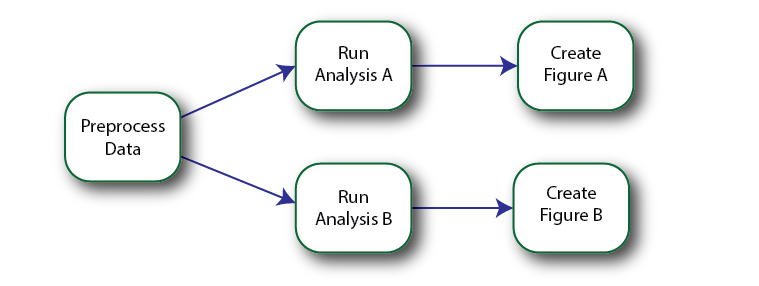
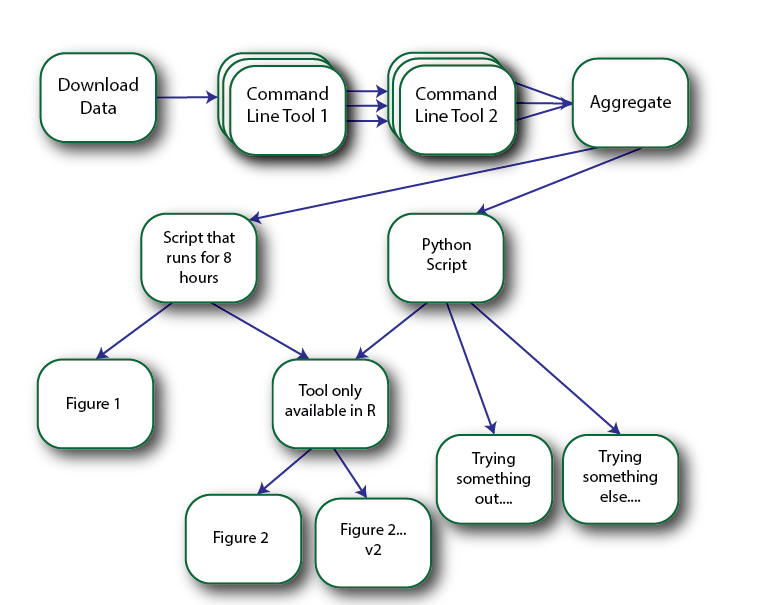
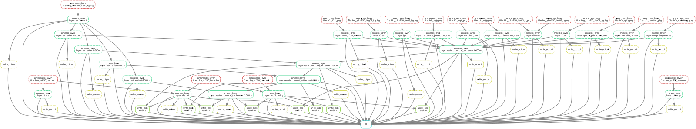
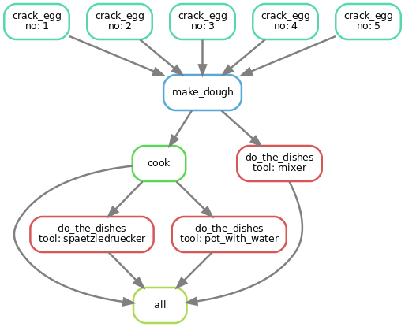

---
author:
- Jonathan Amme
title: Snakemake Workshop
subtitle: or how to cook Spätzle
institute: Reiner Lemoine Institut
classoption: aspectratio=169
date: \today
theme: rli
urlcolor: rlilinkcolor
output:
  pdf_document:
    md_extensions: +grid_tables
header-includes:
- |
  \newcommand{\tel}{+49 (0)30 1208 434 26}
  \newcommand{\email}{jonathan.amme@rl-institut.de}
  \newcommand{\event}{}
  \newcommand{\twitter}{\href{https://twitter.com/RL_Institut}{@RL\_Institut}}
  \newcommand{\finalstatement}{Questions?}
  \tikzset{
  invisible/.style={opacity=0},
  visible on/.style={alt={#1{}{invisible}}},
  alt/.code args={<#1>#2#3}{%
    \alt<#1>{\pgfkeysalso{#2}}{\pgfkeysalso{#3}} % \pgfkeysalso doesn't change the path
  },
  }
  \usetikzlibrary{shapes,arrows}
  \usepackage{blindtext}
nocite: '@*'
---

# Workflow management system

Why would you need a workflow management system (WMS)?

# Example workflow 1

Simple workflow
\center

Source: [deto]

# Example workflow 2

More complex workflow (more steps, different languages, long processing time for individual steps)
\center
{ height=65% }
Source: [deto]

# How can snakemake help you?

- Lightweight workflow management system
- Text-based, python syntax
- Split large data-/workflow into single steps, defined by rules
- Infers dependencies and execution order (DAG)
- Reproducible and scalable data analyses

- Supported languages: BASH commands, Python, Inline python code, R script, R markdown file

# Rules 1

Define how to obtain input files from output files

```
rule copy_single_file:
    input: "/path/to/file_in"
    output: "/path/to/file_out"
    shell: "cp {input} {output}"
```

# Rules 2

Generalize rules using wildcards -> snakemake infers file names from dependencies (DAG)

```
rule copy_multiple_files:
    input: "/path/to/{file}"
    output: "/path/to/{file}_copied"
    shell: "cp {input} {output}"
```

# Rules 3

Use named input files

```
rule annotate_multiple_files:
    input:
      files="/path/to/{file}",
      annotation="/path/to/annotation"
    output: "/path/to/output/{file}_annotated"
    shell: "cat {input.files} {input.annotation} >> {output}"
```

# Rules 5

Use python script

```
rule copy_single_file:
    input: "/path/to/file_in"
    output: "/path/to/file_out"
    script: "my_script.py"
```

# Rules 5

Use python inline code

```
rule copy_single_file:
    input: "/path/to/file_in"
    output: "/path/to/file_out"
    run:
        in = open(input, "r")
        out = open(output, "w")
        for line in f:
            out.write(line)
        in.close()
        out.close()
```

# More features

- Parallelization (threads, can be even run on clusters such as AWS S3)
- Resource allocation (entire workflow or per rule)
- Suspend and resume
- Logging
- Modularity
- Report generation
- ...

# Example 1

Part of the workflow in a current project

\center


# Example 2

Now let's cook some delicious Spätzle! ([Link to Repository](https://github.com/rl-institut/workshop/tree/master/snakemake))

\center
{ height=70% }


[deto]: https://github.com/deto/Snakemake_Tutorial
